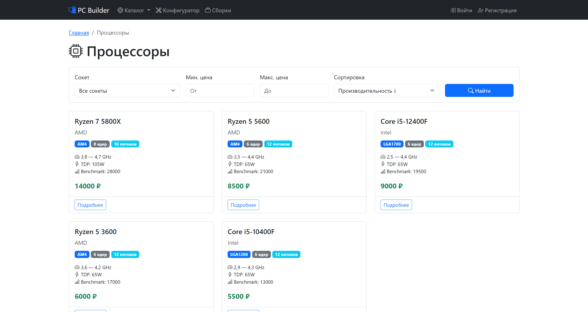
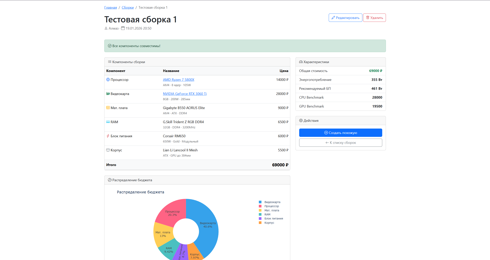

# Ulearn-PythonProject

# Budget PC Builder

Веб-сервис для подбора совместимых компонентов ПК с фокусом на бюджетные игровые 
сборки из б/у комплектующих. Помогает начинающим сборщикам избежать ошибок 
совместимости и оптимизировать бюджет.

**Демо:** [https://neograne.pythonanywhere.com](https://neograne.pythonanywhere.com) - работает только с впн (к сожалению)

---

## MVP

- **Проверка совместимости** — автоматическая валидация сокетов, форм-факторов и мощности
- **Визуальная аналитика** — интерактивные графики распределения бюджета (Plotly)
- **Ориентир по ценам** — средние цены на б/у рынке
- **Сохранение сборок** — личный кабинет для авторизованных пользователей
- **Фильтрация и сортировка** — удобный поиск компонентов

---

## Стек технологий

| Категория | Технологии |
|-----------|------------|
| **Backend** | Python 3.11, Django 5.2 |
| **Database** | SQLite |
| **Frontend** | Bootstrap 5, HTML5, CSS3 |
| **Аналитика** | Pandas, Plotly |
| **Деплой** | PythonAnywhere |

---

## Скриншоты

### Главная страница

*Статистика компонентов и быстрый доступ к функциям*

### Каталог процессоров

*Фильтрация по сокету, цене и сортировка*

### Страница сборки

*Проверка совместимости и график распределения бюджета*

### Конфигуратор

*Пошаговый выбор компонентов*

---

## Локальный запуск

### 1. Клонирование репозитория

```bash
git clone https://github.com/neograne/Ulearn-PythonProject.git
cd Ulearn-PythonProject
cd pc-builder
```

### 2. Создание виртуального окружения

```bash
python -m venv venv

# Windows
venv\Scripts\activate

# Linux/macOS
source venv/bin/activate
```

### 3. Установка зависимостей

```bash
pip install -r requirements.txt
```

### 4. Применение миграций

```bash
python manage.py migrate
```

### 5. Загрузка тестовых данных

```bash
python manage.py loaddata sample_data.json
```

### 6. Создание суперпользователя (опционально)

```bash

python manage.py createsuperuser
```

### 7. Запуск сервера

```bash

python manage.py runserver
```

### 8. Открытие в браузере
Перейдите по адресу: http://127.0.0.1:8000

